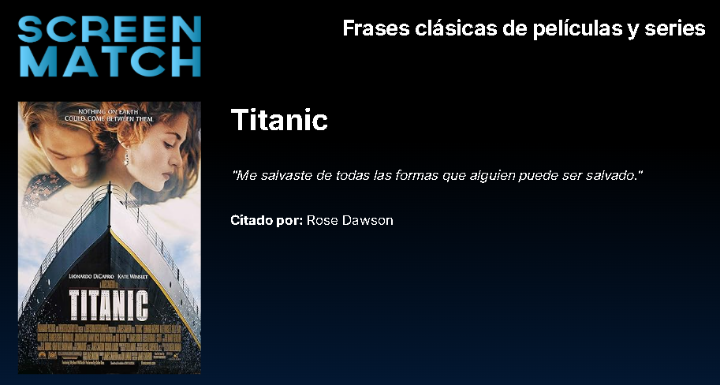
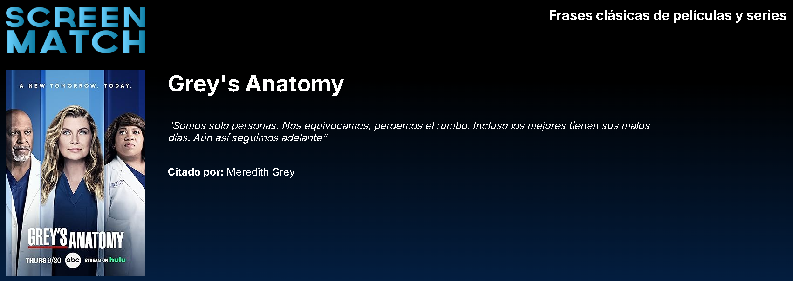

# 📖 Frases ScreenMatch - API Rest en Java

Este proyecto es el desafío final del curso **"Java: creando tu primera API y conectándola al Front End"** del programa **ONE Backend**. 🎉 Fue desarrollado en **Java** utilizando el framework **Spring Boot** para construir una API Rest que permite obtener frases icónicas de series y películas. 📺

## 🚀 Descripción del Proyecto

Esta API proporciona frases aleatorias junto con información adicional, como el título, el personaje y un póster. La API está diseñada para conectarse con un **Frontend** desarrollado por la instructora del curso, disponible [aquí](https://github.com/alura-es-cursos/2086-java-desafio-front). En este frontend podrás consultar las frases y disfrutar de una interfaz amigable. 🌟

## 🛠️ Tecnologías Utilizadas

- **Java 17** ☕
- **Spring Boot 3.0**
- **JPA/Hibernate** para la gestión de la base de datos.
- **PostgreSQL**
- **Maven** para la gestión de dependencias.
- **Cors Configuration** para permitir solicitudes desde el frontend.

## ✨ Conocimientos Aplicados

1. **Diseño de APIs RESTful**: Estructurar y documentar endpoints para facilitar su uso.
2. **Integración con Frontend**: Conexión de una API con una interfaz gráfica para mostrar datos dinámicos.
3. **Manejo de Bases de Datos**: Uso de **JPA** para realizar consultas personalizadas y obtener registros aleatorios.
4. **Anotaciones en Java**: Configuración y simplificación del código mediante anotaciones como `@Entity`, `@Service`, `@RestController`, etc.
5. **Configuración de CORS**: Habilitar la comunicación entre diferentes dominios para mejorar la interoperabilidad.

## 🌟 Beneficios del Proyecto

- Permitió experimentar con el desarrollo completo de una API desde la creación de la base de datos hasta la exposición de los datos a través de un endpoint.
- Reforcé los fundamentos de Spring Boot y su ecosistema.
- Implemente Buenas prácticas de desarrollo, como la separación de responsabilidades y el uso de patrones como DTOs.

## 🌐 Endpoint

| Método | Endpoint         | Descripción                                |
|--------|------------------|--------------------------------------------|
| GET    | `/series/frases` | Obtiene una frase aleatoria de la base de datos. |

## 🖼️ Ejemplo de Respuesta

```json
{
  "titulo": "Breaking Bad",
  "frase": "I am the one who knocks!",
  "personaje": "Walter White",
  "poster": "https://example.com/breaking_bad_poster.jpg"
}
```

## 🎯 Cómo Ejecutar el Proyecto

1. Clona el repositorio en tu máquina local.
2. Asegúrate de tener **Java 17** instalado.
3. Abre el proyecto en tu IDE favorito (como IntelliJ IDEA o Eclipse).
4. Ejecuta la clase `FrasesscreenmatchApplication`.
5. Accede al endpoint `/series/frases` desde Postman, tu navegador o el frontend conectado.

## 🖥️ Imágenes del Proyecto



## 📌 Notas Adicionales

- La conexión con el frontend es esencial para visualizar correctamente las frases con estilos y gráficos. Por favor, asegúrate de que el servidor del frontend esté activo y funcionando en `http://127.0.0.1:5500`.
- El frontend fue desarrollado por la instructora del curso, y puedes encontrar más información [aquí](https://github.com/alura-es-cursos/2086-java-desafio-front).

## 💡 Créditos

Este proyecto fue desarrollado como parte del programa ONE en Backend, con la orientación del equipo de instructores. ¡Gracias por la oportunidad de aprender y crecer! 🚀🌟

Realizado por Anderson Rodríguez 💜
